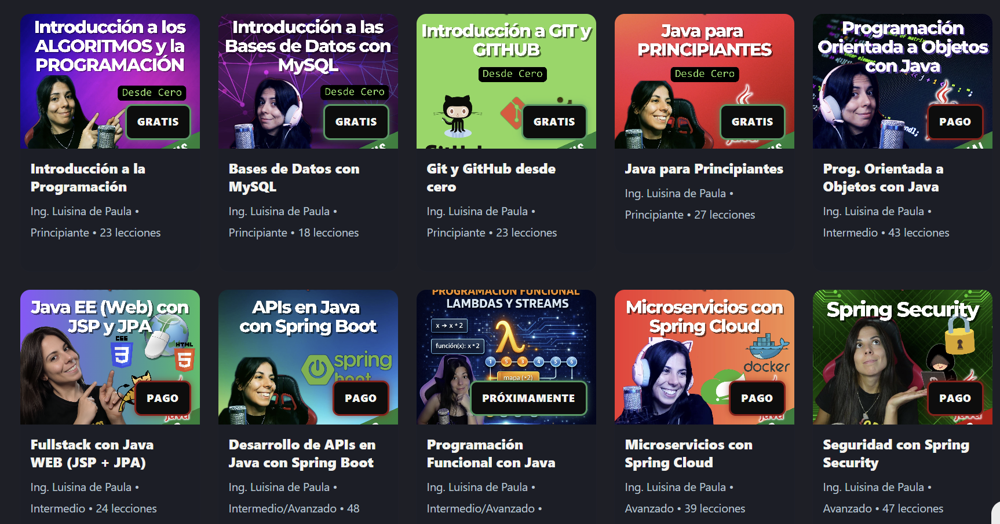

En java hay muchas formas de aprender, pero ningun canal es tan bueno y tiene una comunidad tan accesible como el canal de [todocode](https://www.youtube.com/@TodoCode). Es una youtuber mejicana que ha trabajado como backend developer. Da consejos útiles y tiene diferentes cursos muy bien estructurados.

  <iframe
    src="https://www.youtube.com/embed/qxXcI56NfnE"
    style="position: absolute; inset: 0; width: 100%; height: 100%;"
    frameborder="0"
    allowfullscreen>
  </iframe>

Puedes visitar [todocodeacademy.com](https://todocodeacademy.com/) donde están todas las certificaciones que tiene. Aunque no son certificados muy reconocidos, la condensación de información en ellos son demasiado buenos.

## ROADMAP sugerido

Estos son los cursos a día de hoy. Mi recomendación es usar los siguientes links para estudiar. **Hasta el número 5 son todos gratis**, luego te toca definir a ti si quieres especializarte en Java y comprar los cursos en el siguiente orden.

1. [Java para principiantes](https://www.youtube.com/watch?v=6q7wHs6cH6Y&list=PLQxX2eiEaqbwxYrMUJ6gRz82mLzUeeJy9)
2. [Aprender programación orientada a objetos en su canal de yt](https://www.youtube.com/watch?v=tcza2FEz4u4&list=PLQxX2eiEaqbwNP20GMMCjRslRq2lOLWlg)
3. [Programación funcional en su canal de yt](https://www.youtube.com/watch?v=U0qV-bmphVw&list=PLQxX2eiEaqbz8W1qM9eAxPSF65Zj090-P&index=1&t=0s)
4. [Inicio de desarrollo web con Java](https://www.youtube.com/watch?v=dm0stmK5egM&list=PLQxX2eiEaqbzhvlMJZkyFoZpyo33T6rm7)
5. [Full Stack con Java Web](https://todocodeacademy.com/course/java-web-con-jsp-y-jpa/)
6. [Desarrollo de Apis con Java Spring Boot](https://todocodeacademy.com/course/desarrollo-de-apis-con-spring-boot/)
7. [Micro servicios con Spring Cloud](https://todocodeacademy.com/course/microservicios-con-spring-cloud/)
8. [Seguridad con Spring Security](https://todocodeacademy.com/course/spring-security/)

### ROADMAP TodoCode

Si prefieres un camino sugerido por alguien con mucha más experiencia, en [todocodeacademy.com](https://todocodeacademy.com/) también hay un [roadmap 2026](https://todocodeacademy.com/roadmap/).

  <iframe
    src="https://www.youtube.com/embed/aotSZRKBtQo"
    style="position: absolute; inset: 0; width: 100%; height: 100%;"
    frameborder="0"
    allowfullscreen>
  </iframe>

